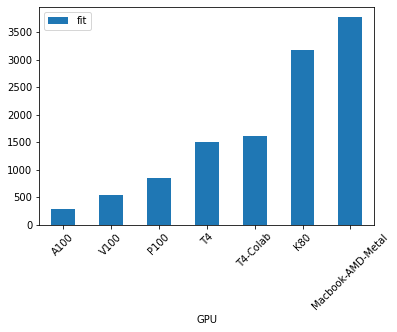
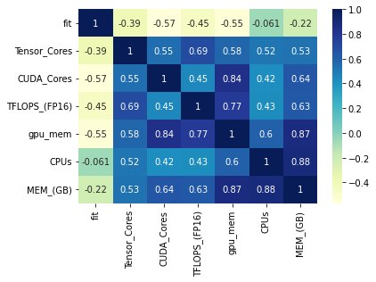

```python
import pandas as pd
import seaborn as sns
```


```python
df = pd.read_csv('gpu-performance.csv')
```

### Raw Data


```python
df
```


<div>
<style scoped>
    .dataframe tbody tr th:only-of-type {
        vertical-align: middle;
    }

    .dataframe tbody tr th {
        vertical-align: top;
    }

    .dataframe thead th {
        text-align: right;
    }
</style>
<table border="1" class="dataframe">
  <thead>
    <tr style="text-align: right;">
      <th></th>
      <th>GPU</th>
      <th>fit</th>
      <th>Tensor_Cores</th>
      <th>transistors_M</th>
      <th>CUDA_Cores</th>
      <th>TFLOPS_(FP16)</th>
      <th>gpu_mem</th>
      <th>CPUs</th>
      <th>MEM_(GB)</th>
    </tr>
  </thead>
  <tbody>
    <tr>
      <th>0</th>
      <td>A100</td>
      <td>280</td>
      <td>432</td>
      <td>54,000</td>
      <td>6912</td>
      <td>78.0000</td>
      <td>40.5</td>
      <td>12</td>
      <td>85</td>
    </tr>
    <tr>
      <th>1</th>
      <td>V100</td>
      <td>529</td>
      <td>640</td>
      <td>21,100</td>
      <td>5120</td>
      <td>31.4000</td>
      <td>16.0</td>
      <td>8</td>
      <td>30</td>
    </tr>
    <tr>
      <th>2</th>
      <td>P100</td>
      <td>846</td>
      <td>0</td>
      <td>15,300</td>
      <td>3840</td>
      <td>19.0000</td>
      <td>16.0</td>
      <td>4</td>
      <td>15</td>
    </tr>
    <tr>
      <th>3</th>
      <td>T4</td>
      <td>1508</td>
      <td>320</td>
      <td>14</td>
      <td>2560</td>
      <td>65.0000</td>
      <td>16.0</td>
      <td>8</td>
      <td>30</td>
    </tr>
    <tr>
      <th>4</th>
      <td>T4-Colab</td>
      <td>1608</td>
      <td>320</td>
      <td>14</td>
      <td>2560</td>
      <td>65.0000</td>
      <td>16.0</td>
      <td>2</td>
      <td>12</td>
    </tr>
    <tr>
      <th>5</th>
      <td>K80</td>
      <td>3184</td>
      <td>0</td>
      <td>7</td>
      <td>4992</td>
      <td>0.0000</td>
      <td>12.0</td>
      <td>4</td>
      <td>15</td>
    </tr>
    <tr>
      <th>6</th>
      <td>Macbook-AMD-Metal</td>
      <td>3769</td>
      <td>0</td>
      <td>6</td>
      <td>0</td>
      <td>6.4000</td>
      <td>4.0</td>
      <td>6</td>
      <td>16</td>
    </tr>
    <tr>
      <th>7</th>
      <td>Macbook-CPU</td>
      <td>57236</td>
      <td>0</td>
      <td>3,000</td>
      <td>0</td>
      <td>0.0025</td>
      <td>0.0</td>
      <td>6</td>
      <td>16</td>
    </tr>
  </tbody>
</table>
</div>


## Peformance~GPU (less is faster)


```python
p = df[['GPU','fit']].iloc[:-1].plot.bar(x='GPU', y='fit', rot=45)
```


    

    


```python
df.corr()[['fit']].sort_values('fit')
```


<div>
<style scoped>
    .dataframe tbody tr th:only-of-type {
        vertical-align: middle;
    }

    .dataframe tbody tr th {
        vertical-align: top;
    }

    .dataframe thead th {
        text-align: right;
    }
</style>
<table border="1" class="dataframe">
  <thead>
    <tr style="text-align: right;">
      <th></th>
      <th>fit</th>
    </tr>
  </thead>
  <tbody>
    <tr>
      <th>CUDA_Cores</th>
      <td>-0.567090</td>
    </tr>
    <tr>
      <th>gpu_mem</th>
      <td>-0.545376</td>
    </tr>
    <tr>
      <th>TFLOPS_(FP16)</th>
      <td>-0.454271</td>
    </tr>
    <tr>
      <th>Tensor_Cores</th>
      <td>-0.387415</td>
    </tr>
    <tr>
      <th>MEM_(GB)</th>
      <td>-0.223066</td>
    </tr>
    <tr>
      <th>CPUs</th>
      <td>-0.060719</td>
    </tr>
    <tr>
      <th>fit</th>
      <td>1.000000</td>
    </tr>
  </tbody>
</table>
</div>


```python
dataplot = sb.heatmap(df.corr(), cmap="YlGnBu", annot=True)
```


    

    

